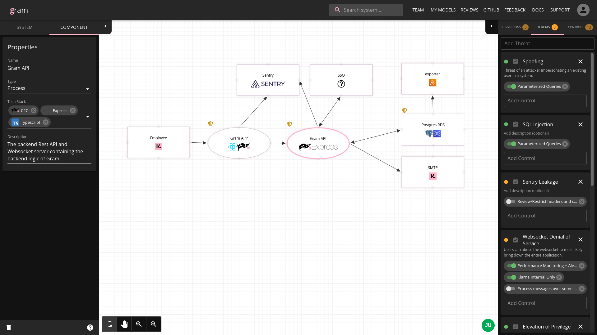

# Gram

[![Build Status][ci-image]][ci-url]
[![License][license-image]][license-url]
[![Developed at Klarna][klarna-image]][klarna-url]

Gram is Klarna's own [threat model][owasp-tm] diagramming tool developed internally by Klarna's Secure Development team. It is a webapp for engineers to collaboratively create threat models for their systems, providing a easy-to-understand way to document a system as a dataflow diagram with threats/controls attached.

## Repository Layout 🗺️

- `app/` contains the frontend react application
- `core/` contains the backend library; most data related logic lies here
- `config/` contains the configuration.
- `api/` contains the backend web API
- `plugins/` contains backend plugins, which when installed into api allows for customization

## Development Setup 💻

These are the minimal steps for starting the project locally:

1. Install the dependencies with `npm i`

2. Start the test and development databases via docker compose `docker compose up -d`

3. `npm run build` to build the api and any installed plugins

4. `npm run dev` to start the backend API and react app frontend.

5. Login using `user@localhost` as the email - check the application logs for the login link.

## Deploying 🚀

Gram is designed to run as a single docker container with a Postgres database provided beside it. Typically the postgres database would be hosted on something like AWS RDS.

The recommended setup is to run Gram as a fork of this repository. That way you can add specific logic for your own organization, as
you will likely want to integrate your own specific data providers.

All configuration exists in the `config/` package. See [config/README.md](config/README.md) for more specific details on how to configure.

### Disclaimers ⚠️

- Setting up will require that you are comfortable programming a bit in typescript (since the configuration is written that way) and that
  you know how to build and deploy a docker image.

- As maintainers of this project, we will only offer limited support and are generally prioritizing features that serve our own implementation for Klarna.

- There are some scalability issues to be aware of - currently we only run this as a single container as the websocket server used for the
  realtime diagram sharing only runs on the same express server. For Klarna's setup this has worked fine since we don't have that many concurrent users,
  but it will eventually hit a bottleneck and means the application can't be scaled horizontally. This is solveable but it's not anything we're prioritizing until it actually becomes a problem.

- This webapp was built with the premise that it would run on an internal-only, closed network and be accessible to all engineers. It will not withstand DoS or necessarily guarantee confidentiality if exposed
  directly on the internet.

## How to contribute 🙋

See our guide on [contributing](CONTRIBUTING.md).

## Release History 📜

See our [changelog](CHANGELOG.md).

<!-- ## Thanks to -->
<!-- TODO: need to grab these from old repo somehow + ideally automate -->

## License ⚖️

Copyright © 2023 Klarna Bank AB

For license details, see the [LICENSE](LICENSE) file in the root of this project.

<!-- Markdown link & img dfn's -->

[ci-image]: https://github.com/klarna-incubator/gram/actions/workflows/ci.yml/badge.svg?branch=master
[ci-url]: https://github.com/klarna-incubator/gram/actions?query=branch%3Amaster
[license-image]: https://img.shields.io/badge/license-Apache%202-blue?style=flat-square
[license-url]: http://www.apache.org/licenses/LICENSE-2.0
[klarna-image]: https://img.shields.io/badge/%20-Developed%20at%20Klarna-black?style=flat-square&labelColor=ffb3c7&logo=klarna&logoColor=black
[klarna-url]: https://klarna.github.io
[owasp-tm]: https://owasp.org/www-community/Threat_Modeling
